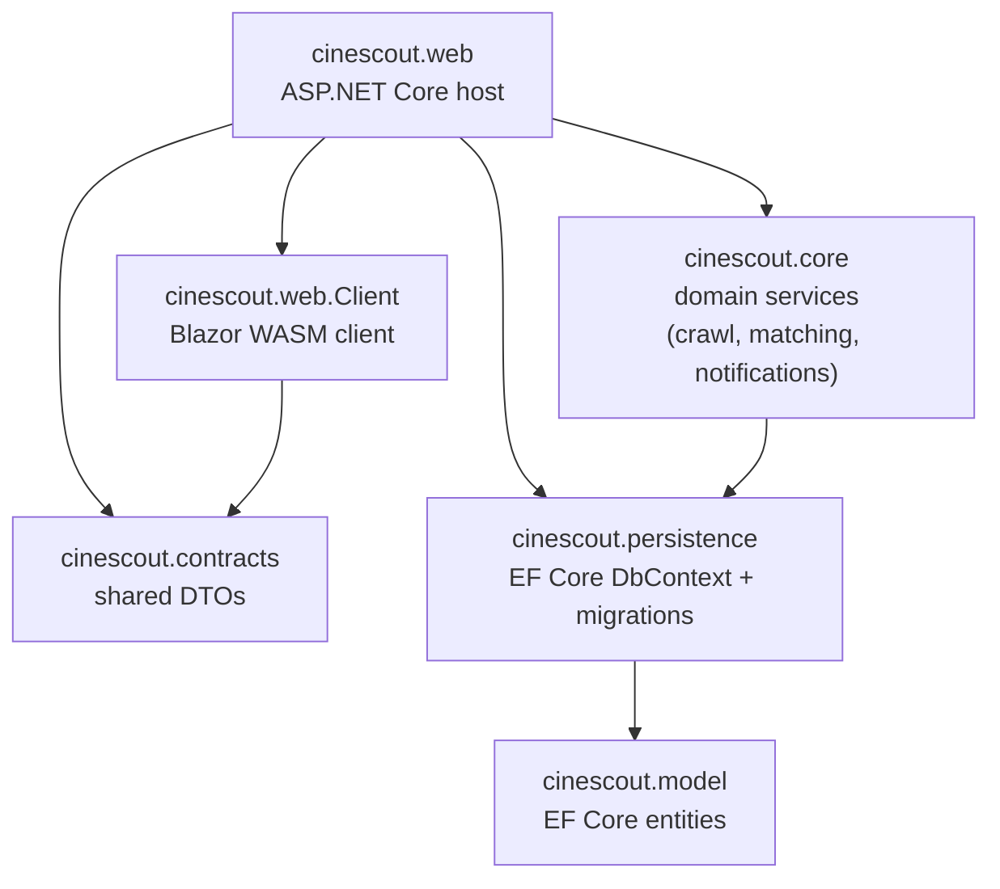

# CineScout

[](https://github.com/peterderkoala/cinescout/actions/workflows/ci.yml)
[](https://peterderkoala.github.io/cinescout/)

<!--
CI badge tracks `dev` (?branch=dev) — `main` is still just the initial commit (see the release
wayfinder map, issue #100) and has never had a CI run of its own yet. Switch this to `main` (or
drop the query param, which defaults to the repo's default branch) once dev is promoted there.
-->

CineScout automates movie-going logistics for a local cinema: it crawls the cinema's schedule and
Kinoheld's seat-availability data, lets you mark movies as "tracked", and alerts you when a
tracked movie's screening matches your preferred time/room/seating — with a direct link straight
into the booking flow. See [`docs/CONTEXT.md`](docs/CONTEXT.md) for the domain glossary and
[`docs/adr/`](docs/adr/) for the architectural decisions behind it.

This is a personal, single-user, self-hosted app — not a multi-tenant SaaS.

## Status

The full v1 feature set from the original spec is built and tested: scheduled crawling of the
cinema's listings and Kinoheld seat data, the time/seat-matrix matching engine, Discord/email
notifications, cookie-based auth with a first-run setup flow, and all nine screens of the web UI
(Schedule, Tracked Movies, Time Preferences, Seat Matrices, Cinemas, Home, Performance Detail,
Login/Setup). 289+ tests across the solution — current coverage is tracked live at the
[Coverage badge](https://peterderkoala.github.io/cinescout/) above.

What's still in progress: automated deployment to a VPS via GitHub Actions + Watchtower, tracked
as a [wayfinder map](https://github.com/peterderkoala/cinescout/issues/100) with its own child
tickets — CI (test-on-every-push) is done, the release/publish side is being worked through
incrementally. Until that lands, deploying is the manual `docker compose` process below.

## Architecture

Six projects under `src/`, split so the WASM client never depends on anything server-only (EF
Core/Npgsql aren't WASM-appropriate to ship to the browser) and the DTO layer stays a true leaf
both sides of the wire can see:



- **`cinescout.web`** — the ASP.NET Core host. Serves the Blazor WASM client, hosts the `/api`
  endpoints each screen calls, runs the Hangfire-scheduled crawl/matching jobs, and owns
  authentication (cookie-based, gates the whole app by `AuthorizationOptions.FallbackPolicy`).
- **`cinescout.web.Client`** — the WASM client: every interactive page and shared UI component
  (`FilmPerformanceCard`, `SeatGrid`). Talks to the host only through `cinescout.contracts` DTOs
  over `/api`, never touches the database directly.
- **`cinescout.core`** — domain services with no UI concerns: the Hall-of-Fame schedule crawl, the
  Kinoheld room/seat crawl (with its own circuit breaker), the time-window/seat-matrix matching
  engine, and the Discord/email notifiers.
- **`cinescout.contracts`** — the shared DTO project. A true leaf: never references `model`,
  `persistence`, or `core`, so both `web` and `web.Client` can depend on it safely.
- **`cinescout.persistence`** — `CineScoutDbContext`, EF Core migrations, and the design-time
  factory `dotnet ef` uses.
- **`cinescout.model`** — the EF Core entity set (`Cinema`, `Film`, `Performance`, `Room`,
  `SeatStatus`, etc.). A true leaf, referenced by everything that needs to read/write the database.

Each production assembly has a matching `*.Tests` project (see [`CLAUDE.md`](CLAUDE.md) for the
full per-project testing conventions — real Postgres via Testcontainers for anything touching the
database, no bUnit for `.razor` markup).

### Repository layout

- `src/` — all `.slnx`/`.cs` files, organized into the subprojects above.
- `docker/` — `Dockerfile`, `docker-compose.yml`, `.env.example`; see [Running it](#running-it).
- `docs/` — everything non-code: the domain glossary (`CONTEXT.md`), architectural decisions
  (`adr/`), UI/API design references (`design/`, `api/`), and agent-facing conventions (`agents/`).
- `.github/workflows/` — CI/CD pipelines (GitHub Actions requires this exact location).

## Running it

The only supported way to run CineScout is `docker compose`, building the image locally from
source (never pulled from Docker Hub).

### Prerequisites

- Docker with Compose v2 (`docker compose`, not the standalone `docker-compose`).
- If you front the app with your own reverse proxy (e.g. Nginx Proxy Manager) for TLS: that proxy
  running as its own Docker Compose stack, on its own Docker network.

### 1. Clone and configure

```sh
git clone https://github.com/peterderkoala/cinescout.git
cd cinescout
cp docker/.env.example docker/.env
```

Edit `docker/.env` and fill in real values — every variable is documented inline in
`docker/.env.example`, including which ones are optional and what their defaults are. At minimum,
set a real `POSTGRES_PASSWORD` (and match it in `ConnectionStrings__Postgres`). Everything else
(Discord webhook, outbound email, crawl intervals, reverse-proxy trust) can be left at its default
and configured later.

`docker/.env` is git-ignored — never commit it.

### 2. Reverse-proxy network (optional, if fronting with your own proxy)

`docker/docker-compose.yml` attaches the `app` service to an external Docker network named
`npm-network`, so your reverse proxy can reach it directly without depending on host-bridge NAT
source IPs. This network is **not created by this repo** — create it yourself (or rename the
`npm-network` references in `docker/docker-compose.yml` to match a network your proxy stack
already creates):

```sh
docker network create npm-network
```

Then point your reverse proxy at the `app` container on that network, terminating TLS there —
CineScout itself is HTTP-only internally and does not redirect to HTTPS.

Once you know the network's real subnet (`docker network inspect npm-network`), set
`ForwardedHeaders__KnownNetwork` in `docker/.env` to it, so the app trusts your proxy's
`X-Forwarded-For`/`X-Forwarded-Proto` headers. Left unset, forwarded headers aren't trusted from
anywhere (safe default) — requests will just show the proxy's IP/scheme instead of the real
client's.

If you don't use a reverse proxy at all, you can drop the `networks:` block from the `app` service
in `docker/docker-compose.yml` and just hit `http://<host>:8080` directly — `ports: - "8080:8080"`
is exposed either way.

### 3. Start the stack

```sh
docker compose -f docker/docker-compose.yml up --build -d
```

This builds the image from source, starts Postgres (gated on its own healthcheck), applies
database migrations automatically, and starts the app and its background crawl jobs.

### 4. First-run setup

Watch the startup logs for a one-time setup token:

```sh
docker compose -f docker/docker-compose.yml logs -f app
```

Look for a line like:

```
First-run setup required. Visit /setup and enter this token: <token>
```

Visit `http://<host>:8080/setup` (or your reverse-proxy URL), enter that token plus your chosen
password, and submit. You'll be signed in immediately. From then on, use `/login` — the token is
single-use and only valid while the app's `User` row has no password set yet.

### Checking on it

- **Health**: `docker inspect --format='{{json .State.Health}}' <app-container-name>` reports the
  container's Docker `HEALTHCHECK` status (web liveness + a coarse Hangfire-alive signal), or hit
  `/healthz` directly.
- **Logs**: written to both stdout (`docker compose logs app`) and a rotating file inside the
  named `log-data` volume (`/app/logs` in the container), 14 days of daily-rolling retention.

## Development

See [CLAUDE.md](CLAUDE.md) for the full project layout, local (non-Docker) run/test instructions,
and architectural conventions.
